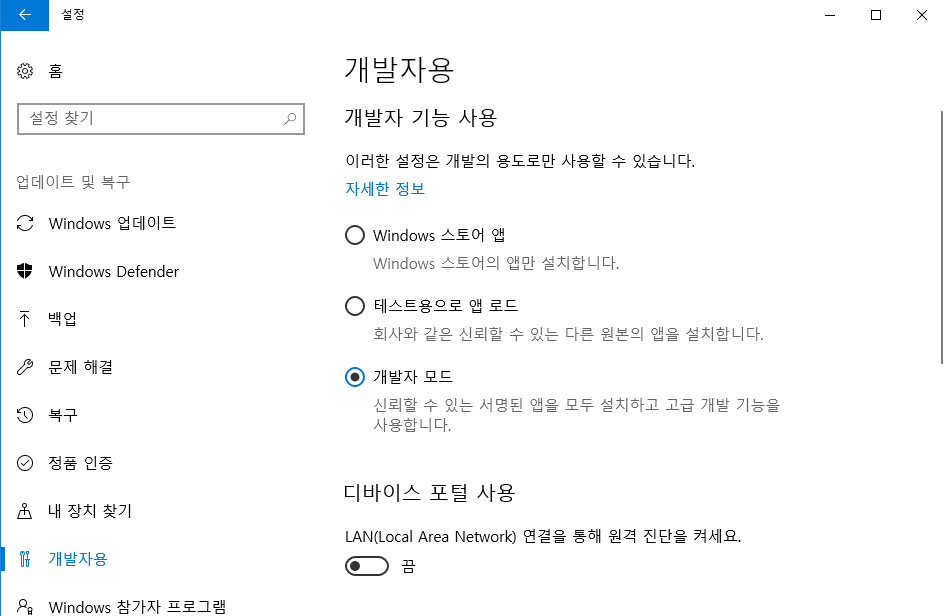
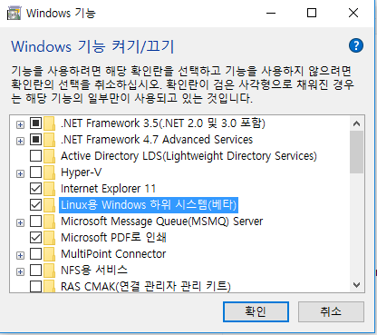

# Windows Bash로 개발환경 설정하기
윈도우에 내장된 리눅스 쉘을 사용하여 개발환경을 구성할 수 있습니다.
기존의 윈도우에서 git bash 등을 이용해서 사용하는 것과 비교해 속도가 빠릅니다.

시스템 요구사항
Windows 10 - Build 14316 이상
64비트 운영체제

Bash Shell에 대한 자세한 내용은 김은지 Evangelist님의 글을 참고해주시기 바랍니다.
[참고](https://blogs.msdn.microsoft.com/eva/?p=7633)

시스템 요구사항의 경우 작년 Windows Anniversary Update 버전이지만 저는 Windows Creator Update를 먼저 수행한 후에 진행하였습니다. 따라서 이 문서의 내용은 Windows Creator Update를 설치한 후에 진행한 내용인 것을 참고하시기 바랍니다.

이 문서의 내용은 아래의 순서로 진행됩니다.
[1. Bash 활성화](#1-bash-활성화)
[2. apt-get 서버 변경](#2-apt-get-서버-변경)

## 1. Bash 활성화
----------------
Bash를 동작시키기 위해서는 두가지 작업이 필요합니다. 

### 1-1. 개발자 모드로 변경
윈도우의 **설정 > 업데이트 및 복구 > 개발자용**으로 화면을 이동하여 개발자 기능 사용의 개발자 모드를 선택합니다.




### 1-2. WSL(Windows Subsystem for Linux) 기능 활성화
윈도우의 **설정 > 앱 > 프로그램 및 기능 > Windows 기능 켜기/끄기**로 화면을 이동하여 Linux용 Windows 하위 시스템(베타) 기능을 체크합니다.




재부팅을 합니다.
Bash는 **Cmd** 또는 **PowerShell**을 **관리자 권한**으로 실행한 후에 **bash** 명령어를 수행합니다.

처음 bash를 수행하는 경우 계정 설정이 필요할 수 있습니다.
계정을 설정한 후에 버전을 확인합니다.
```shell
$lsb_release -a
```
우분투 버전 **16.04.2 LTS**가 description에 표시되어야 합니다.
만약 이전에 한 번이라도 bash를 활성화한 적이 있다면 우분투 버전 **14.04**가 표시될 것입니다. 

우분투 버전을 업데이트 하는 방법은 1-2를 체크해제 후 다시 체크하는 방법으로는 되지 않습니다. 업데이트 하는 방법은 [How to Update the Windows Bash Shell to Ubuntu 16.04](https://www.howtogeek.com/278152/how-to-update-the-windows-bash-shell/)를 참고하시기 바랍니다.(혹시 영어가 어려운 분들은 명령어만 따라서 수행하시면 됩니다. 이때 **Option One**은 uninstall 후에 다시 install하는 방법이고 **Option Two**는 upgrade를 수행하는 방법입니다.)

## 2. apt-get 서버 변경
----------------------
apt-get은 데비안 계열 리눅스의 패키지 관리 명령어입니다. 레드햇 계열에는 yum이 있고 맥에는 brew 같은 것이 있습니다.
그런데 Bash 내부의 apt-get은 서버의 위치가 해외로 되어 있고 느린 편입니다. 그래서 이 서버를 한국의 서버로 변경할 것인데 조사해 본 결과 Daum의 것을 많이 추천하여 Daum 서버로 변경할 것입니다. 

변경 방법은 [우분투(Ubuntu) apt-get 저장소 변경하기](http://shshsh.tistory.com/60)를 참고하였습니다.

먼저 서버위치가 저장된 파일을 백업하고 vi 에디터를 이용하여 실행합니다.
```shell
$cd /etc/apt/sources.list
$sudo cp sources.list sources.list.bak
$sudo vi sources.list
```

기본적으로 3줄이 등록되어 있습니다.
```
deb http://archive.ubuntu.com/ubuntu/ xenial main restricted universe multiverse
deb http://archive.ubuntu.com/ubuntu/ xenial-updates main restricted universe multiverse
deb http://security.ubuntu.com/ubuntu/ xenial-security main restricted universe multiverse
```

**archive.ubuntu.com**과 **security.ubuntu.com**을 **ftp.daum.net**으로 변경합니다.
vi 명령을 이용하여 쉽게 고칠 수 있습니다. 
```
:%s/archive.ubuntu.com/ftp.daum.net
```

security도 같은 방법으로 고쳐줍니다.
```
:%s/security.ubuntu.com/ftp.daum.net
```

아래와 같이 변경되었다면 `:wq`로 저장하고 종료합니다.
```
deb http://ftp.daum.net/ubuntu/ xenial main restricted universe multiverse
deb http://ftp.daum.net/ubuntu/ xenial-updates main restricted universe multiverse
deb http://ftp.daum.net/ubuntu/ xenial-security main restricted universe multiverse
```

추가로 apt 명령어에 대해서는 Outsider님의 [Ubuntu의 apt-get 명령어 정리](https://blog.outsider.ne.kr/346)를 참고하시기 바랍니다.


## 그 밖에 이야기
제 환경에서는 nvm과 node를 윈도우 용으로 설정해놓은 상태였습니다. 그래서 bash 에서 nvm이나 node 명령어를 실행시켰을때 없는 명령어가 아닌 오동작이 섞여있었는데 이 내용은 관리자 권한으로 cmd를 실행하지 않아서 생기는 문제였습니다. 항상 bash를 실행할 때는 관리자 권한으로 실행하는 습관을 갖는게 좋을 것 같습니다.
그 밖에 배쉬에서도 윈도우에 설치한 프로그램과 설정된 path를 이용해서 접근할 수 있는데 그렇기 때문에 저는 bash 안에 nvm을 다시 설치했습니다. 물론 Visual Studio 에서도 노드 명령어를 자동으로 수행할 수 있도록 하기 위해 nvm-windows도 유지하고 있습니다.

[nvm](https://github.com/creationix/nvm)을 참고하여 nvm을 설치할 수 있습니다.
```shell
$curl -o- https://raw.githubusercontent.com/creationix/nvm/v0.33.1/install.sh | bash
```
nvm 을 설치한 후 node를 설치합니다. 현재 LTS 버전인 6.10.2를 설치하겠습니다.
```shell
$nvm install 6.10.2
```
nvm, node, npm 버전을 확인합니다.
```shell
$nvm --version
$node -v
$npm -v
```

## 설치하기까지
맥이 없는 환경에서 우분투를 설치하기에는 윈도우나 맥 두가지만 지원하는 프로그램이 필요한 상황이었습니다. 하지만 윈도우에서 git bash를 이용하거나 가상머신을 이용하여 리눅스를 동작시키는 것 역시 마음에 들지 않았습니다. 그렇다고 윈도우 환경으로만 개발하기엔 마찬가지로 불편함이 존재했었습니다. 그래서 작년에 bash를 설치해봤지만 beta 버전이고 아직 문제가 많다고 하여 사용을 미루고 있었고 이번 Windows 10 Creator Update를 설치하면 사용하기로 마음먹고 있었습니다. 그런데 윈도우 업데이트 후 확인해보니 여전히 beta로 되어있었습니다. 하지만 더이상 뒤로 미룰 수 없기 때문에 확인해보기 위해 환경을 설정하고 react 프로젝트를 빌드해봤고 결과는 만족스러웠습니다. 

Bash는 윈도우에서 cmd나 powershell을 이용하듯 명령어만 우분투 Bash를 이용하여 윈도우를 사용합니다. 물론 리눅스 프로그램을 사용하는 것이 주 목적이기 때문에 이것 또한 문제없습니다. 윈도우 환경변수의 Path에 포함되어 있는 프로그램들은 Bash 내부에서도 Path가 등록되어 동작할 수 있습니다. 저는 Windows 용 **Visual Studio Code**가 설치되어 있기 때문에 Bash에서 프로젝트 디렉토리로 이동하여 `code .`을 실행하여 프로젝트를 열 수 있습니다. 추가로 확장자가 없는 명령어가 설정되지 않았다면 확장자를 꼭 붙여서 실행해줘야 합니다. 다음 두가지 명령어를 수행해보세요.
```
cmd
cmd.exe
```

## 현재까지 찾은 문제점
윈도우 프로그램에서는 /mnt/ 아래 폴더부터 접근할 수 있습니다. 예를 들면 아래 명령들은 올바른 경로에 접근하지 못합니다.
```shell
code ~/.gitconfig
code /etc/apt/sources.list
```
이는 Bash에서 윈도우에 접근할 수는 있지만 윈도우에서 Bash 쉘 안의 경로에 접근할 수 없기 때문에 발생하는 문제입니다. 따라서 윈도우 프로그램에서 접근이 필요한 경우는 /mnt/ 아래에 등록되어야 할 것이며 이외의 파일은 vi 등을 이용하여 수정해야 할 것입니다.

**윈도우를 좋아하신다면 꼭 설치해서 사용해보세요.**